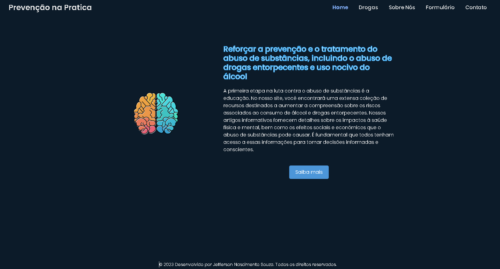
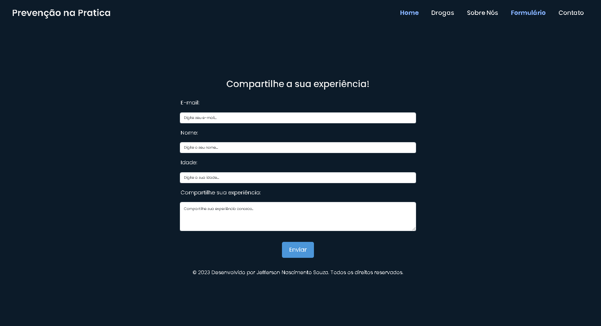
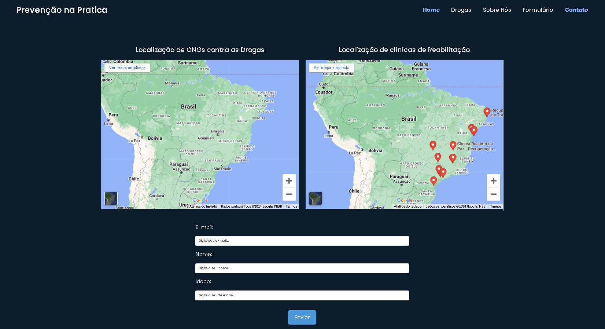

# Prevenção na Prática

<strong>Prevenção na Prática</strong> é um projeto desenvolvido em Angular e Bootstrap, com a utilização da API BREVO para transmissão de mensagens via e-mail e SMS. O objetivo do projeto é auxiliar na prevenção do abuso de substâncias e fornecer informações essenciais sobre os efeitos dessas substâncias.

## Objetivos

- **Auxiliar na prevenção do abuso de substâncias:** Disponibilizando informações e recursos que ajudem a conscientizar e educar sobre os riscos e consequências do uso de substâncias.
- **Fornecer informações sobre os efeitos das substâncias:** Oferecendo dados precisos e atualizados sobre como diferentes substâncias afetam o organismo.
- **Criação de um fórum online:** Um espaço para compartilhamento de experiências, onde os usuários podem discutir e apoiar uns aos outros.
- **Localização de clínicas de reabilitação e ONGs:** Facilitando a busca por locais de tratamento e apoio.

## Baseado no ODS 3 da ONU

O projeto foi criado com base no Objetivo de Desenvolvimento Sustentável 3 (ODS 3) da ONU, que aborda o subtema: "Reforçar a prevenção e o tratamento do abuso de substâncias, incluindo o abuso de drogas entorpecentes e o uso nocivo do álcool." O Prevenção na Prática nasceu com a missão de enfrentar esse problema de frente, oferecendo recursos e informações essenciais para fortalecer tanto a prevenção quanto o tratamento.

## Tecnologias Utilizadas

- **Angular 18**
- **Bootstrap**
- **API BREVO**

## Funcionalidades

- **Verificação de E-mail:** O sistema utiliza a API BREVO para verificar de forma básica se um e-mail é válido ou não, informando ao cliente sobre a validade do e-mail.
- **Envio de Mensagens:** Envio de mensagens via e-mail e SMS utilizando a API BREVO.

<H2>Instalação e Execução</H2>

- **Clone o repositório:**

```bash
git clone https://github.com/seu-usuario/prevencao-na-pratica.git
```
- **Instale as dependências:**
```bash
cd prevencao-na-pratica
npm install
```
- **Execute o projeto:**
```bash
ng serve
```
- **Acesse no navegador:**
```bash
http://localhost:4200
```
## Screenshots


*Tela incial*


*Formulário*


*Localização de clínicas*

## Contribuições
Contribuições são bem-vindas! Sinta-se à vontade para abrir issues e pull requests no repositório.

<strong>Prevenção na Prática</strong> - Fortalecendo a prevenção e o tratamento do abuso de substâncias para um futuro mais saudável.

Copiar código
